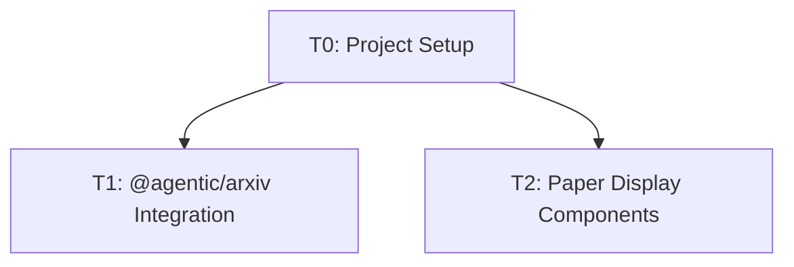

# Task Registry
*Last Updated: 2025-04-26*

## Active Tasks
| ID | Title | Status | Priority | Started | Dependencies |
|----|-------|--------|----------|---------|--------------|
| T0 | Project Setup | 🔄 IN PROGRESS | HIGH | 2025-04-26 | - |
| T1 | @agentic/arxiv Integration | ⬜ TODO | HIGH | - | T0 |
| T2 | Paper Display Components | ⬜ TODO | HIGH | - | T0 |

## Task Details

### T0: Project Setup
**Description**: Initialize project structure, documentation, and base configuration
**Status**: 🔄 IN PROGRESS
**Last Active**: 2025-04-26
**Completion Criteria**:
- Set up memory bank documentation
- Configure essential project dependencies
- Initialize basic project structure
- Set up development environment

**Related Files**:
- `memory-bank/*`
- `package.json`
- `vite.config.ts`
- `tsconfig.json`

**Notes**: Following KIRSS principle for minimal but sufficient setup

### T1: @agentic/arxiv Integration
**Description**: Integrate @agentic/arxiv package for direct arXiv paper access
**Status**: ⬜ TODO
**Last Active**: -
**Completion Criteria**:
- Install and configure @agentic/arxiv
- Create paper fetching hooks
- Implement search functionality
- Add category filtering support

**Related Files**:
- `src/hooks/useArxiv.ts`
- `src/lib/arxiv.ts`

**Notes**: Keep integration minimal and focused on essential features

### T2: Paper Display Components
**Description**: Create core UI components for displaying papers
**Status**: ⬜ TODO
**Last Active**: -
**Completion Criteria**:
- Create PaperCard component
- Create PaperList component
- Implement paper detail view
- Add basic styling with ShadcnUI

**Related Files**:
- `src/components/PaperCard.tsx`
- `src/components/PaperList.tsx`
- `src/components/PaperDetail.tsx`

**Notes**: Use ShadcnUI components for consistent styling

## Completed Tasks
None yet.

## Task Relationships

