# Task Registry
*Last Updated: 2025-04-27*

## Active Tasks
| ID | Title | Status | Priority | Started | Dependencies |
|----|-------|--------|----------|---------|--------------|
| T1 | @agentic/arxiv Integration | ✅ COMPLETE | HIGH | 2025-04-26 | T0 |
| T3 | Static Research Profile | ✅ COMPLETE | HIGH | 2025-04-26 | T0, T1 |
| T4 | ML-Enhanced Profile | ⬜ TODO | MEDIUM | - | T3 |
| T5 | Catchup Page Implementation | 🔄 IN PROGRESS | HIGH | 2025-04-27 | T0, T1, T3 |
| T6 | Paper Bookmarking System | ⬜ TODO | MEDIUM | - | T1, T2 |
| T7 | Search State Persistence | ✅ COMPLETE | HIGH | 2025-04-27 | T1, T5 |

## Task Index
Detailed task information is maintained in individual files under `/tasks/`:
- [T0: Project Setup](/tasks/T0_project_setup.md) ✅
- [T1: @agentic/arxiv Integration](/tasks/T1_arxiv_integration.md) 🔄
- [T2: Paper Display Components](/tasks/T2_paper_components.md) ✅
- [T3: Static Research Profile](/tasks/T3_static_research_profile.md) 🔄
- [T4: ML-Enhanced Profile](/tasks/T4_ml_enhanced_profile.md) ⬜
- [T5: Catchup Page Implementation](/tasks/T5_catchup_page.md) 🔄

## Completed Tasks
| ID | Title | Completed |
|----|-------|-----------|
| T0 | Project Setup | 2025-04-27 |
| T2 | Paper Display Components | 2025-04-27 |

## Task Relationships

```mermaid
graph TD
    T0[T0: Project Setup ✅]
    T1[T1: @agentic/arxiv Integration]
    T2[T2: Paper Components ✅]
    T3[T3: Static Research Profile]
    T4[T4: ML-Enhanced Profile]
    T5[T5: Catchup Page]
    
    T0 --> T1
    T0 --> T2
    T0 --> T3
    T1 --> T5
    T3 --> T4
    T3 --> T5
```

## Task Management Guidelines
- Each task has a dedicated file in `/tasks/` with detailed information
- Status indicators: ✅ Complete, 🔄 In Progress, ⏸️ Paused, ⬜ Todo
- Priority levels: HIGH, MEDIUM, LOW
- Dependencies must be clearly listed
- Follow KIRSS principle for all implementations